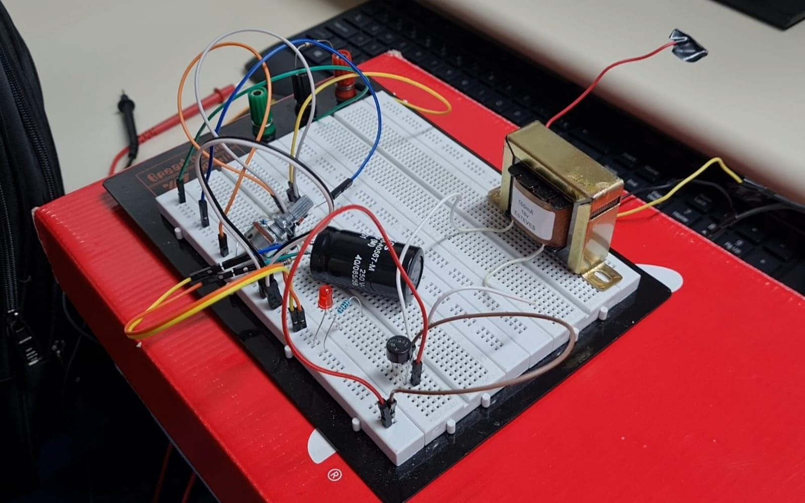
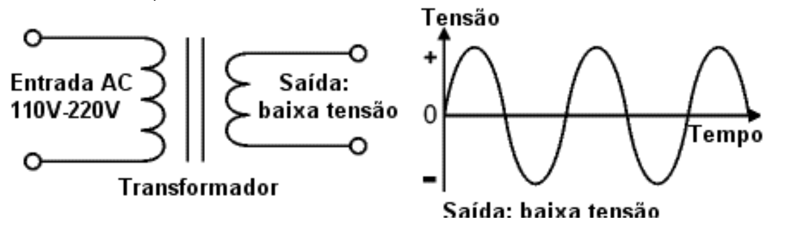
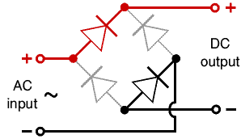
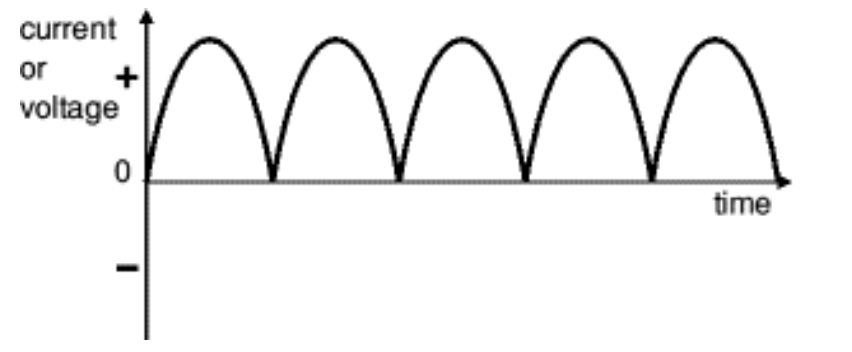
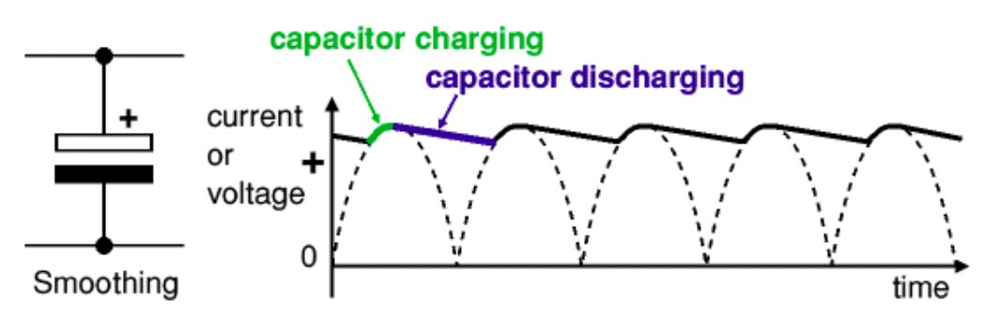
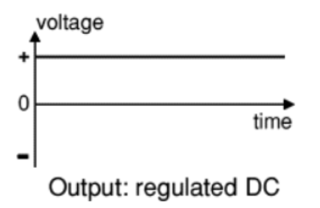
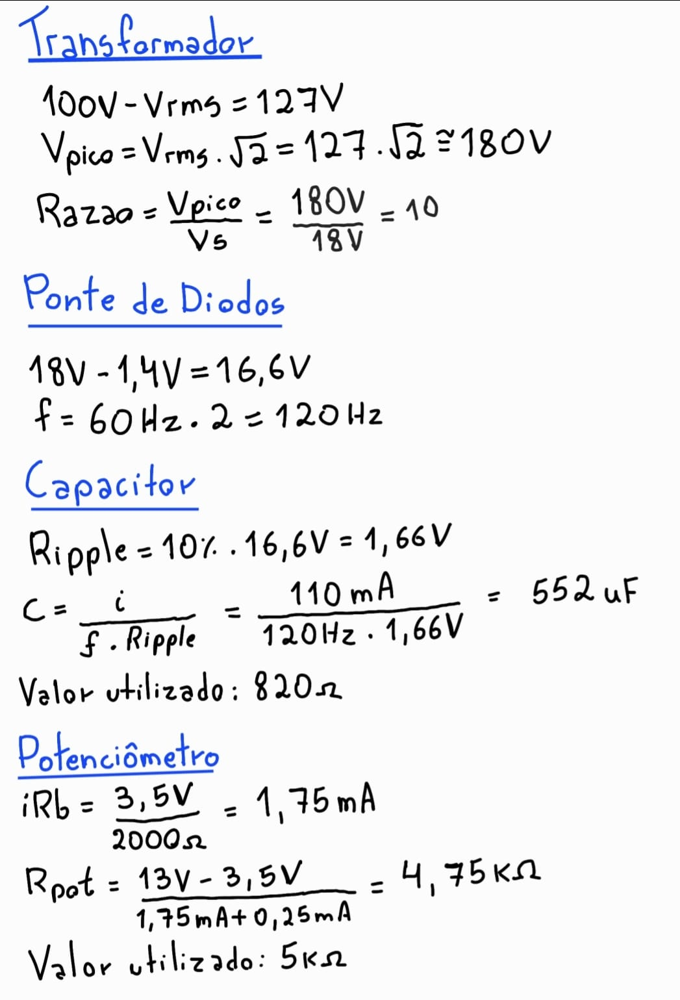
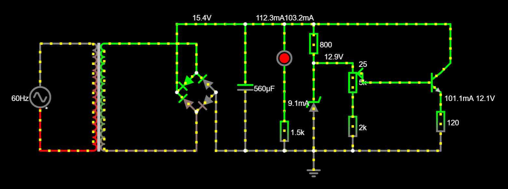
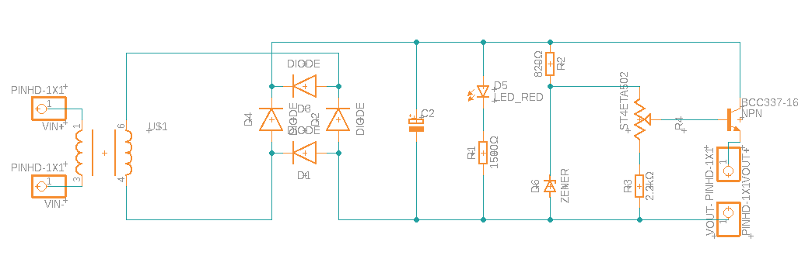
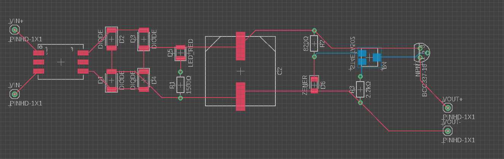

# SCC0180-Fonte-Ajustavel
Projeto de fonte ajustável para a disciplina de Eletrônica para Computação (SCC0180), cursada em 2022 na USP.

## Visão Geral
O objetivo da fonte é transformar a corrente alternada da tomada (220V ou 110V) em uma tensão menor, entre 3V e 12V, e de corrente contínua, com capacidade de 100 mA.

## Os componentes

### Transformador
Resumo: Transforma a tensão AC da tomada em uma tensão AC menor e utilizável.

O transformador é um dispositivo composto por duas bobinas acopladas a um núcleo magnético. Seu objetivo, neste projeto, é reduzir a tensão da tomada a uma tensão utilizável pela fonte. Seu funcionamento baseia-se no princípio de indução eletromagnético, no qual a bobina primária ligada na tomada cria um campo magnético que induz uma corrente na bobina secundária. Como as bobinas têm quantidades de espiras diferentes, a corrente e a voltagem serão diferentes em cada lado, mas a potência será constante.
  
  

### Ponte Retificadora
Resumo: Transforma uma tensão AC, que possui valores positivos e negativos, em uma tensão polarizada DC,ou seja, que possui apenas valores positivos.

A ponte retificadora é composta por 4 diodos colocados em pares alternados que transformam tanto a seção positiva quanto a negativa da corrente AC em uma tensão polarizada DC.

  

Entretanto, a ponte consome 1,4V de tensão, pois a corrente sempre passa por dois diodos, que consomem 0,7V de tensão cada. Tal consumo será considerado nos cálculos mais adiante.
Além disso, as pontes retificadores são classificadas pela corrente máxima que os diodos suportam e pela voltagem reversa máxima que elas conseguem conter. Tal voltagem máxima deve ser pelo menos 3 vezes a voltagem RMS da fonte.
  
  

### Filtragem
Resumo: Transforma a corrente polarizada em contínua.

A filtragem é feita por um capacitor que carrega rapidamente e descarrega lentamente da seguinte forma:
  
  

Essa pequena diferença entre máximo e mínimo deixada pelo capacitor é chamada de ripple. Quanto menor o ripple melhor será a fonte.
  
### Regulação
Resumo: Lineariza o máximo possível a saída da fonte, de modo a oferecer uma tensão constante.

Neste projeto, o regulador será composto por um resistor e um diodo de zener ligado ao contrario. O resistor serve para diminuir a corrente que chega ao diodo, que após uma certa tensão zener aplicada, deixa apenas esse valor de tensão passar, barrando o excedente e oferecendo uma corrente contínua.
  
  

### Potenciômetro
O potenciômetro é um resistor com resistência variável. Sua função no projeto é limitar a tensão após o zener, fazendo com que a fonte ofereça uma tensão de 3V a 12V.

## Cálculos

## Componentes escolhidos
| Quantidade | Componentes        			                | Valor R$ |
|------------|------------------------------------------|----------|
| 1          | TRANSFORMADOR 500MA 18V ESTEVES       	  | R$ 43,20 |
| 1          | PONTE RETIFICADORA 2W10M 2A 800V JINNAN  | R$ 4,00  |
| 1          | CAPACITOR ELCO 560UFX250V 85°C 40X20MM   | R$ 0,25  |
| 1          | LED 5MM VM DIFUSO 333-2SDRD/S530-L    	  | R$ 0,50  |
| 1          | RESISTOR MRS 1K5 1% PHOENIX   		        | R$ 1,10  |
| 1          | RESISTOR MRS 2K 1% PHOENIX      		      | R$ 1,00  |
| 1          | RESISTOR MRS 820R 1% PHOENIX  		        | R$ 1,10  |
| 1          | POTENCIÔMETRO 1W B5K B-16,5XE-20XR-7MM  	| R$ 7,00  |
| 1          | DIODO ZENER 13V 1/2W 1N5243 SEMTECH     	| R$ 0,62  |
| 1          | TRANSISTOR BC337-40 N 50V 0,8A TO-92 LGE | R$ 0,69  |
| 1          | JUMPER MACHO X MACHO 20CM TOWER KIT	    | R$ 7,00  |
| **Total**  |                    			                | R$ 91,94 |

## Circuito no Falstad

Para acessar o circuito no Falstad clique [AQUI](https://tinyurl.com/2b8vw6qc).

## Esquemático no Eagle

## PCB no Eagle

## Vídeo explicando e mostrando a fonte

https://youtu.be/U6hq4gx4mk4

## Alunos

* Felipe Scholucha Martinez Roldan 
* Laura Neri Thomaz da Silva
* Lucas Greff Meneses
* Vitor Hugo Almeida Couto
